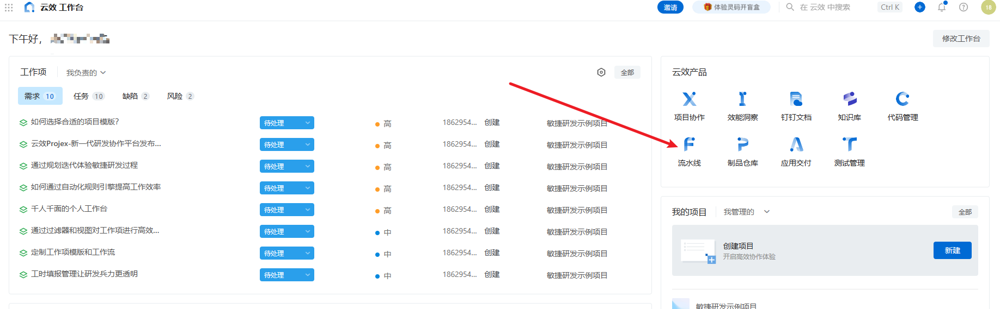
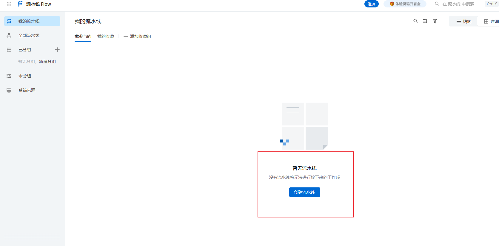
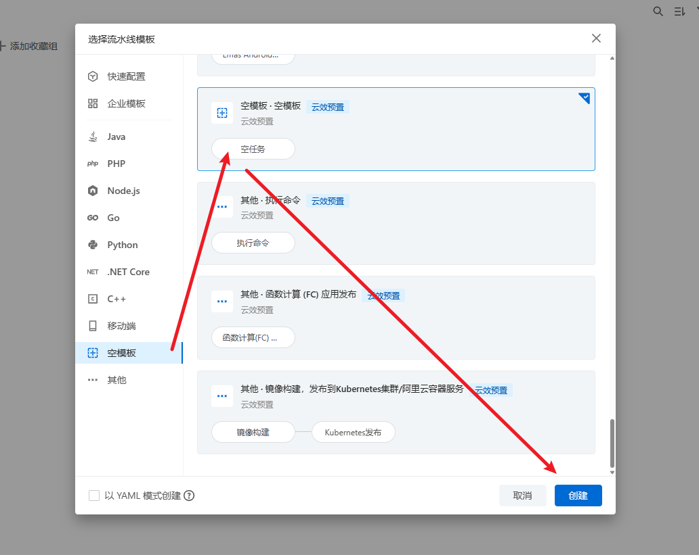
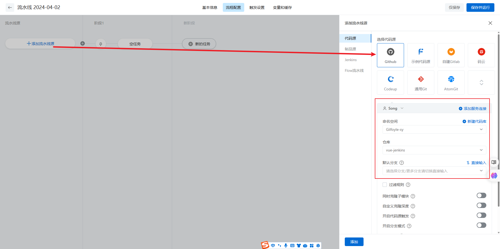
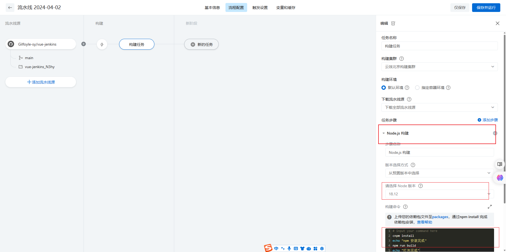

# 云效

> 云效 AppStack 是以应用为中心的云原生应用交付平台，提供应用全生命周期管理、研发流程管理（CI/CD）、测试环境管理、部署运维等一站式应用交付能力，基于应用模板、角色权限支持企业级批量配置全局管控，帮助企业建立应用交付整体解决方案，加速企业云原生与 DevOps 转型。

上一章节，我们推荐的 jenkins 虽然开源，但是使用和配置的门槛很高，汉化不完全，页面操作也略微复杂。但是 CI/CD 其实是前端工程化的一个环节，市面上的云平台都有各自的 CI/CD 功能模块，顺便还集成了一大堆功能，而且国产的，可视化操作，功能齐全，完全可以当团队的协作平台来使用。

## 注册

云效目前是免费的，使用阿里云账号就能登录使用

## 流水线

右侧选择流水线

新建流水线

使用空模版

关联远程仓库

设置构建任务，选择 nodejs 构建，选择版本，添加构建命令（其实在工作中，我们还会配置很多的东西，比如构建触发点，构建前的代码检测等等）

