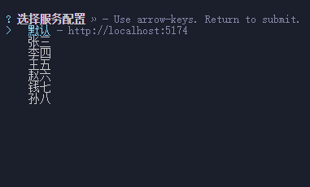
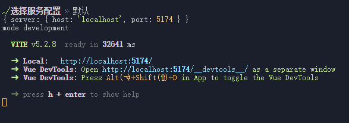
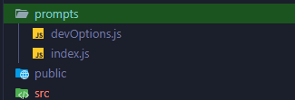
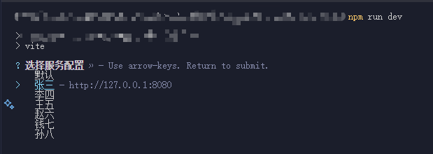
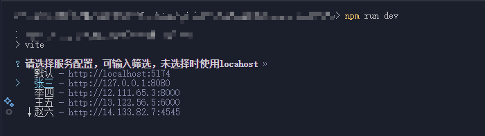

# 命令行交互工具

> 使用交互式提示来进行命令行操作

使用 vue，vite，react 等创建脚手架时，第一步就会通过命令行交互工具来提前对脚手架的配置进行一些设置，比如是否启用 ts，eslint，单元检查等等。然后脚手架根据选择的配置项，生成对应的模板，这种命令行交互的实现，可以更直观的去启动配置项目

## 项目场景

如果做过多人开发，就一定遇见过每个人的 host，port，接口地址等 都配置在了一个文件中。

每次都需要手动去修改，如果你上传了自己的配置到 git，其他人拉去代码后，又得重新手动去修改对应的配置文件和配置项。

如果时启动配置项写在了 package.json 中，又会导致 package.json 的启动命令过多，不便于直观理解。

理想状态是，每次 npm run dev 的时候，可以直接选择使用哪个开发人员的配置项，这样既保证了配置文件无需改动，package.json 文件也无需添加新的指令。





## Prompts

git 主要的命令行交互工具有 propmts，inquirer，enquirer

vite 使用的是 [propmts](https://github.com/terkelg/prompts?tab=readme-ov-file#selectmessage-choices-initial-hint-warn)

下面就实现一下通过 propmts 实现选择服务配置项后运行 vue 项目

## 实现

### 安装

注意：node 版本需要在 14 以上

```cmd
npm install --save prompts
```

### 目录

在根目录新建一个文件夹

devOptions 内存放配置项

index 用来实现命令行交互指令



### 配置项

简单写几个例子，实际项目后可能还会有 proxy 及后端服务的选项

```js
// devOptions

const servers = {
  '默认': { host: 'localhost', port: 5174 },
  '张三': { host: '127.0.0.1', port: 8080 },
  '李四': { host: '12.111.65.3', port: 8000 },
  '王五': { host: '13.122.56.5', port: 6000 },
  '赵六': { host: '14.133.82.7', port: 4545 },
  '钱七': { host: '15.144.50.9', port: 7777 },
  '孙八': { host: '16.155.12.10', port: 9999 }
}

export default servers
```

### 具体实现

```js
// index.js

import prompts from 'prompts' // 引入prompts
import servers from './devOptions.js' // 配置项

// 因为最后的命令行问题模式是选项模式
// 所以此处先初始化choice
const initChoice = (obj) => {
  return Object.entries(obj).map(([title, options]) => {
    return {
      title,
      description: `http://${options.host}:${options.port}`,
      value: options
    }
  })
}
```

```js
// 人员较少时的单选
const selectQuestions = (obj) => {
  return {
    type: 'select',
    name: 'server', // 最终选择完成后key
    message: '选择服务配置',
    choices: initChoice(obj)
  }
}

// 人员较多时的单选，可输入过滤
const autocompleteQuestions = (obj) => {
  return {
    type: 'autocomplete',
    name: 'server', // 最终选择完成后key
    message: '请选择服务配置，可输入筛选，未选择时使用locahost',
    initial: 1,
    limit: 5, // 最多显示多少项
    // 输入过滤
    suggest: (input, choices) =>
      choices.filter((i) => i.title.toLowerCase().includes(input.toLowerCase())),
    choices: initChoice(obj),
    // 未找到时的提示
    fallback: {
      title: '未找到相关配置',
      value: 'error'
    }
  }
}
```

```js
// 导出方法
export const serverPrompts = async () => {
  // 可以根据开发人员的多少选择模式
  const response = await prompts(selectQuestions(servers))
  // const response = await prompts(autocompleteQuestions(servers))
  return response.server
}
```

### vite.config.js 中调用

因为 prompts 返回的是个 promise 方法,所以调用的时候只要 await 后,就会阻止 npm run dev 的执行,选择完成后再继续执行内部指令

```js
// vite.config.js

import { serverPrompts } from './prompts/index.js'

// 获取选择的配置项
const serverOptions = await serverPrompts()

export default defineConfig(({ mode }) => {
  return {
    // 设置配置项
    server: {
      host: serverOptions.host,
      port: serverOptions.port
    }
  }
})
```

### 最终效果





## 仓库地址

[Git](https://github.com/Gilfoyle-sy/song_prompts)
